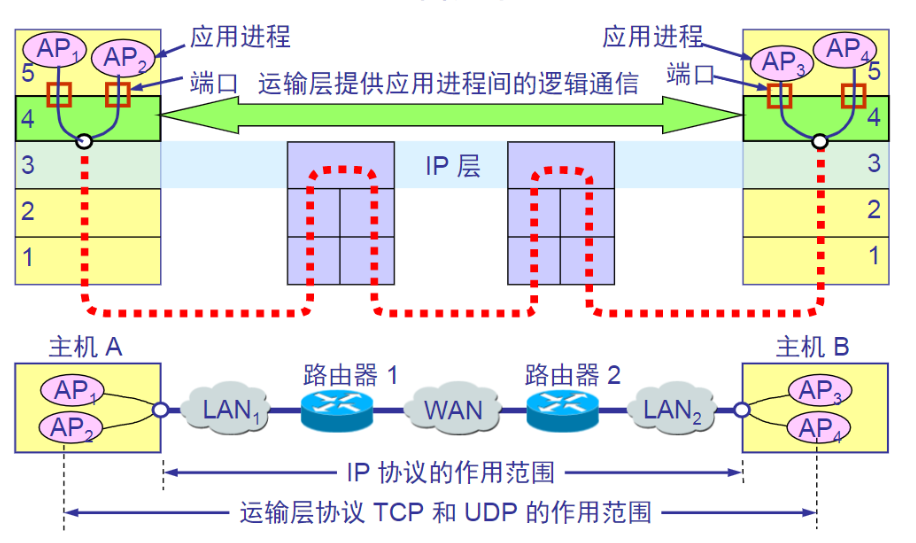
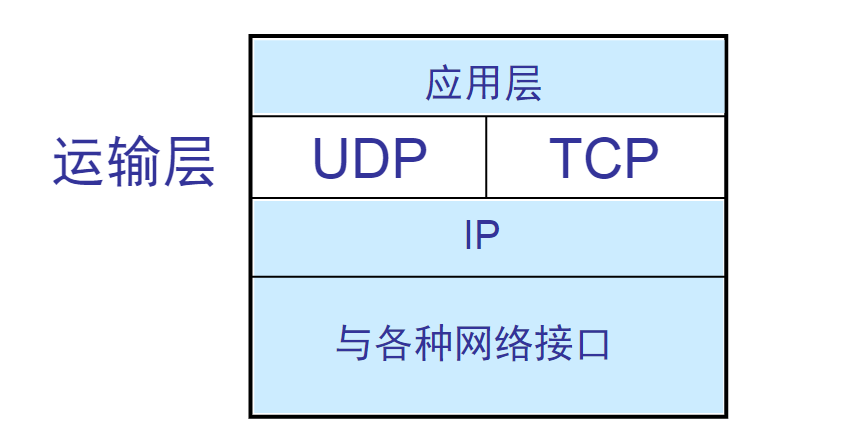

## 进程之间的通信
从通信和信息处理的角度看，**运输层向它上面的应用层提供通信服务**，它属于面向通信的最高层同时也是用户功能中的最低层  
当网络的边缘部分的两台主机使用网络的核心部分进行通信时，只有主机的协议栈才拥有运输层，而网络核心部分的路由器在转发分组的过程中只用到了下三层。  

仅有网络层不够：
- 真正通信的实体是主机中的进程**应用进程互相通信**
- IP协议虽然将分组送到目的主机，但这个分组还停留在主机的网络层还没有交付到主机的应用进程
- 端到端的通信应该是进程之间的通信，一个主机中总是有多个应用进程同时和另一个主机多个应用进程进行通信
    - 这表明运输层有一个重要的功能**复用**和**分用**  

所以运输层为应用进程之间提供端到端的逻辑通信  
逻辑通信：好像这种通信是沿着水平方向直接传送数据的，但事实上这两个运输层之间并没有一条水平方向的物理连接。数据的传送是沿着图中虚线方向传送的

运输层的其他重要功能  
- 对收到的报文进行差错检测，（数据部分
- 根据应用程序的需求不同，运输层有两种不同的运输协议，**面向连接的TCP**和**无连接的UDP**  

运输层向高层用户屏蔽了下面网络核心的细节  
当运输层采用TCP传输协议时，尽管下面的网络是不可靠的，但是这条逻辑信道是一条全双工的可靠信道  
但是UDP协议时，这种逻辑信道是一条不可靠信道  
## 运输层的两个主要协议
1. 用户数据报协议UDP[RFC768]
2. 传输控制协议TCP[RFC793]  

两个对等运输实体在通信时传送的数据单位叫**运输协议数据单元TPDU**  
- TCP传送的数据单位协议叫 TCP报文段 segment  
- UDP传送是那个的数据单元协议叫做UDP用户数据报  

UDP在传送数据之前不需要建立任何的连接，对方在接收到UDP报文之后也不需要任何确认，不可靠但某些时候有效  
TCP提供面向连接的服务，不提供广播或多播服务。由于TCP要建立可靠的、面向连接的运输服务，增加了开销比如确认、流量控制、计时器、连接管理，这使协议数据单元的首部增加很多，占用了很多处理机资源  

注意：
- 运输的UDP数据报与IP数据报有很大的区别。IP数据报要经过互连网中许多路由器的存储转发，而UDP用户数据报实在运输层的抽象的端到端的逻辑信道中传送的
- TCP报文段在运输层抽象的端到端的逻辑信道中传送，这种信道是全双工的可靠信道。但是这样的信道却不知道究竟进过了哪些路由器，而这些路由器也不知道上面的运输层是否建立了tcp连接
## 运输层的端口
* 运行在计算机中进程用`进程标识符`来标志  
* 在互联网环境下，让操作系统来给这种进程指派标识符是不行的。  
原因：因特网使用的计算机的操作系统种类很多，而不同的操作系统又使用不同格式的进程标识符
所以 要用统一的方法（与操作系统无关）对TCP/IP体系的应用程序进行标志  
### 需要解决的问题
- 由于进程的创建和撤销都是动态的，**发送方几乎无法识别其他机器上的进程**  
- 有时我们会改换接收报文的进程，但并不需要通知所有的发送方  
- 我们往往需要目的主机的功能来识别终点，但不需要知道实现这个功能的进程是哪个  
### 解决这个问题的方法是在运输层使用协议端口号 简称端口  
这就是说，虽然通信的重点是应用进程但是可以将所传送的报文交到目的主机的某个合适的目的端口（即最后交付的目的进程），剩下的工作由TCPUDP来完成  
>这种在协议栈之间抽象的协议端口是软件端口，和路由器上或交换机上的硬件端口是不同的概念。硬件端口是不同硬件设备进行交互的接口，软件端口是**应用层的各种协议进程**与运输实体进行层间交互的一种地址。不同系统实现端口方法不同  
### TCP的端口
TCP/IP的运输层用一个十六位的端口号来标志一个端口
>端口只有本地意义，即端口号只是为了标志计算机应用层的各进程。在因特网中不同计算机的相同端口号是没有关联的
### 三类端口 
通信时必须要知道对方服务器的IP地址和端口号  
- 服务器端使用得端口号
    - 熟知端口号 0~1023或系统端口号  
    将这些端口号指派给了TCP/IP最重要的一些应用程序。
    - 登记端口号 1024~49151  
    没有熟知端口号的应用程序使用，使用这些端口号需要在IANA登记防止重复
- 客户使用的端口号：客户端口号或短暂端口号49152~69935  
留给客户短暂使用，当服务器进程收到客户进程的报文时，就知道了客户进程所使用的动态端口号，因而可以把数据发送给客户进程。通信结束后，该端口可供其他客户进程使用

