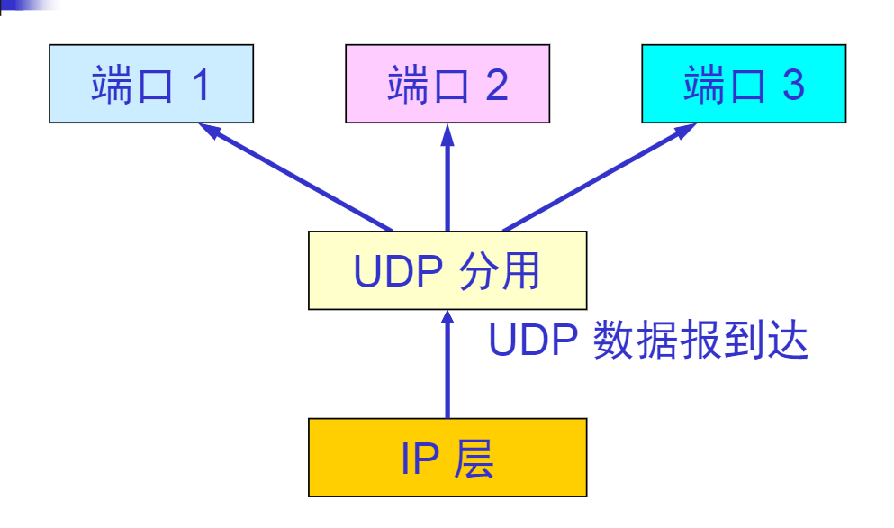

# UDP概述
- UDP只在IP的数据报服务之上增加了很少的功能，复用和分用的功能和差错检测的功能 

UDP的主要特点是
1. UDP是无连接的，发送之前不需要建立连接
2. UDP尽最大可能交付，不保证可靠交付
3. UDP不使用拥塞控制
4. UDP是面向报文的，没有拥塞控制，很适合多媒体对通信的需求
5. UDP支持一对一 一对多 多对多 多对一的通信
6. UDP的首部开销小，只有八个字节，比TCP的20个字节首部短   
 
>2->主机不需要维持复杂的连接状态表  
4->UDP对应用层交付下来的报文,添加首部之后直接向下交付给IP层，既不拆分又不合并，保留这些报文的边界   
4-> 应用层交给UDP多长的报文，UDP就照样发送，一次发送一个报文  
4->接收方UDP对IP层叫上来的UDP用户数据报，去掉首部后就原封不动地交付上层的应用进程  
4->应用程序必须选择合适大小的报文，否则降低IP层的效率  
3->网络出现拥塞不会使源主机发送速率降低  

检验和：检测UDP用户数据报在传输中是否有错  
长度：UDP用户数据报的长度  
当运输层从IP层收到UDP数据报时，就根据首部中的目的端口，把UDP数据报通过相应的端口，上交到终点 应用进程
下图是UDP基于端口的复用

> 虽然在UDP之间通信要用到端口号，但是不需要套接字，TCP之间的通信必须要在两个套接字之间  
在计算检验和时，临时要把伪首部和UDP用户数据报连接在一起，仅仅是为了计算检验和
# 传输控制协议TCP概述
### TCP最主要的特点
- TCP是面向连接的运输层协议，在每次数据传输前，要建立TCP连接，结束后要释放已经建立的TCP连接
- 每一条TCP连接只能有两个端点，每一条TCP连接只能是点对点的
- 全双工通信 TCP允许双方在任何时候都能发送数据。连接的两端都设有缓存区，用来存放双向通信的数据
- 面向字节流
### 面向流的概念——————

TCP把应用层交付下来的数据看成**无结构**的字节流。TCP不保证接收方应用程序所受的数据块和发送方应用程序所发送的数据块具有对应的大小关系。所以接收方的应用程序必须要有能力识别收到的字节流把它还原成有意义的应用层数据。  
>
- 实际上，TCP报文段要先传送到IP层加上IP首部，再到链路层加上链路层首部和尾部才离开主机发送到物理链路 
- TCP对一次把多长的报文段发送到TCP的缓存中是不关心的
- TCP根据对方给出的窗口值和当前网络的拥塞程度来决定一个报文段应该包含多少个字节（udp发送的报文长度是由应用进程给出的
- TCP可以将太长的数据块划分短一点再传送。TCP也可等待积累有足够多的字节后再构成报文段发送出去  
## TCP的连接
* TCP把连接作为最基本的抽象
*   每一条TCP连接有两个端点
* TCP连接的端点不是主机，不是主机的IP协议，不是应用进程，也不是协议端口。TCP连接的端点叫做套接字(socket)或插口
* 端口号拼接到IP地址构成套接字
### 套接字
`套接字socket=(IP地址:端口号)`  
每一条TCP连接唯一地被通信两端的两个端点（两个套接字）所确定  
`TCP连接::={socket1,socket2}={(IP1:port1),(IP2,port2)}`
socke有很多不同的意思
1. 应用编程接口API成为socketAPI
2. socketAPI中一个函数名叫socket
3. 调用socket函数的端点称为socket
4. 调用socket函数时其返回值称为socket描述符，可简称为socket
5. 在操作系统内核中的联网协议的Berkeley实现称为socket实现
# 可靠传输的工作原理
### 停止等待协议
    这里讨论可靠传输的原理，将数据单元都叫做分组，不考虑数据在哪一个层次上发送。在运输层并不使用这种协议。运输层传输报文段，网络层传送的协议数据单元叫做IP数据报，统一讨论问题时，把他们叫做分组
停止等待就是 每发送完一个分组就停止发送，等待对方的确认。在收到确认后再发送下一个分组。

超时计时器
- 在发送完一个分组之后必须要暂时保留已经发送的分组（超时重传使用）
- 分组和确认分组都必须进行编号
- 超时计时器的重传时间应当比数据在分组传输的平均往返时间要长一点  
确认丢失和确认迟到

在B收到了第二次M1时它的行动
1. 丢弃这个分组M1
2. 向A发送确认(之前没收到  

综上
在不可靠的传输网络上实现可靠的通信  
这种可靠传输协议常称为**自动重传请求ARQ**  
ARQ表明重传的请求是自动进行的。接收方不需要请求发送方重传某个出错的分组
### 信道利用率
停止等待协议的信道利用率太低  
U=TD/TD+RTT+TA  
TD 发送分组需要的时间 RTT往返时间 T发送确认分组时间  
### 流水线传输
* 发送发可连续发送多个分组，不必发送完一个分组就停顿下来等待对方的确认
* 由于信道上一直有数据不间断地传送，这种传输方式可获得很高的信道利用率
### 连续ARQ协议

5个分组连续发送出去，发送方每收到一个确认 将发送窗口向前滑动一个分组的位置。  
#### 累积确认
接收方一般采用累计确认的方式。即不必对收到的分组逐个发送确认，而是对按序到达的租后一个分组发送确认，这样就表示：到这个分组为止的所有分组都已正确收到了  
累积确认的优点是：实现容易，丢失不重传。缺点是不能向发送方反映出接收方已经正确收到的所有分组的信息  
#### Go-back-N（回退N
如果发送方发送了前5个分组，而中间的第三个分组丢失了。此时接收方只能对前面两个分组发出确认。发送方无法知道后面三个分组的下落，只好把后面的分组再重传一次这就要回退N，当通信线路不好时ARQ会带来负面影响
### TCP可靠通信的具体实现
1. TCP连接的每一端都必须设有两个窗口————一个发送窗口和一个接收窗口。
2. TCP的可靠传输机制用字节的序号进行控制，TCP所有的报文都是基于序号而不是基于报文
3. TCP两端的四个窗口经常处于动态变化之中
4. TCP连接的往返时间RTT也不是固定不变的。需要使用特定的算法估算较为合理的重传时间