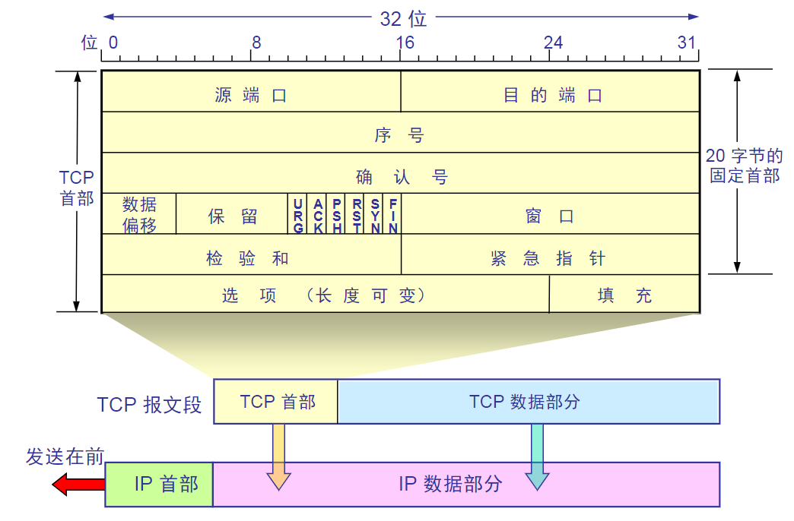

TCP虽然是面向字节流的，但TCP传送的数据单元却是报文段。

- 端口是运输层和应用层的服务接口。运输层的复用和分用功能都要通过端口才能实现
- 序号字段 4字节。mod2^32运算。TCP连接中的数据流中的每一个字节都编上一个序号。序号字段的值则指的是本报文段所发送的数据第一个字节的序号。
- 确认号 4个字节，是期望收到对方的下一个报文段的数据地第一个字节的序号
若确认号=N，则代表到N-1为止的报文段已收到
- 数据偏移（即首部字段）4位，它指出TCP报文段的其实数据处距离TCP报文段的起始处有多远。偏移的单位是32位字，以四字节为计算单位
- 保留字段 6位，保留为今后使用，目前是0
- 紧急URG URG为1时，表明紧急指针字段有效，此报文段中有紧急数据，应尽快传送（相当于高优先级数据
- 确认ACK 当ACK为1时确认号字段有效，0时无效
- 推送PSH 接收TCP收到PSH=1的报文段，就尽快交付接收应用进程，而不等整个缓存都满了再向上交付
- 复位RST 当RST为1时，表明TCP连接中出现严重差错，应该释放连接重新建立运输连接
- 同步SYN 同步SYN为1时代表这是一个连接请求或连接接受报文
- 终止FIN 用来释放一个连接。FIN=1表明此报文段的发送端数据已经发送完毕，并要求释放运输连接
- 窗口 2字节，用来让对方设置发送窗口的依据，单位为字节
- 校验和 梁子杰。检验和字段检验的范围包括首部和数据这两本分。计算检验和时，要在TCP报文段前面加上12字节伪首部
- 紧急指针字段-16位，指出本报文段中紧急数据共有多少个字节，紧急数据放在本报文段数据的组前面
- 选项字段 长度可变 TCP最初只规定了一种选项，即最大报文段长度MSS
- 其他选项 窗口扩大选项 3字节 时间戳选项 10字节 选择确认选项
- 填充字段 这是为了使整个首部长度是4字节的整数倍